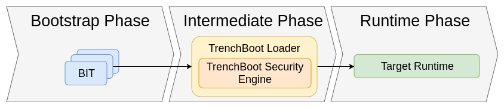

# TrenchBoot FAQ

1. [Why use Trenchboot?](#1-why-use-trenchboot-background-info)
2. [How does TrenchBoot work?](
    #2-how-does-trenchboot-work-trenchboot-architecture)
3. [How to use Trenchboot?](#3-how-to-use-trenchboot-practical-usage)
4. [Why does TrenchBoot use an intermediate launcher?](
    #4-why-does-trenchboot-use-an-intermediate-launcher)
5. [What are the benefits of measurement over signature validation?](
    #5-what-are-the-benefits-of-measurement-over-signature-validation)
6. [What do I need to incorporate TrenchBoot into my system?](
    #6-what-do-i-need-to-incorporate-trenchboot-into-my-system)
7. [Where do I start if I want to help with contributions?](
    #7-where-do-i-start-if-i-want-to-help-with-contributions)
8. [Where to find the sources?](#8-trenchboot-sources)
9. [Various GitHub and further documentation links](
    #9-various-github-and-further-documentation-links)

## 1. Why use Trenchboot? (background info)

### What is Trust?

Trust is when the computer does something on our behalf and we have to trust it
with our data. A trusted component is that which always behaves in an expected
manner.  To make a component "trusted", you must establish some root of trust.
A Root of Trust Measurement is the process of measuring (hashing) components on
a system to validate their integrity. When establishing a root of trust, there
are two primary schools of thought: Static Root of Trust Measurements and
Dynamic Root of Trust Measurements.

### SRTM

SRTM Starts with Core Root of Trust for Measurement (CRTM), and works its way
up the chain where each link verifies the next. In other words, SRTM starts by
measuring the BIOS boot block and then moves on to measure the rest of the BIOS.

### DRTM

DRTM aims to address shortcomings of SRTM. DRTM creates trusted environment from
an untrusted state. Essentially what this means is that regardless of weather
or not computer was booted from trusted software, it uses hardware to ensure
that no malicious software, which may or may not have been run before the
dynamic launch, can impact software started after the dynamic launch. For this
reason, DRTM takes place after boot, as opposed to SRTM, which takes place
pre-boot. Intel's solution for DRTM is TXT, which utilizes special instructions
on the processor (SMX). AMD's solution for DRTM is called SKINIT. Trenchboot
provides a solution for setting up DRTM for an arbitrary platform.

### Typical Measured Launch Process

The process for carrying out DTRM depends on your system:

- [Intel TXT: Software Development Guide][txt-spec]
- [System Programming Volume of for AMD64 (PDF)][skinit-spec] (see
  "Secure Startup with SKINIT" section)

[txt-spec]: https://www.intel.com/content/www/us/en/content-details/315168/intel-trusted-execution-technology-intel-txt-software-development-guide.html
[skinit-spec]: https://www.amd.com/system/files/TechDocs/24593.pdf

### So, why TrenchBoot?

- Managing multiple independent components individually can be confusing
- Most DRTM systems are platform-dependent
- Most DRTM systems can only measure entities already present in RAM at the
    time DRTM sequence is initiated
- Most DRTM systems support only one attestation action

## 2. How does TrenchBoot work? (trenchboot architecture)

### Architecture Overview

*The full architecture overview can be found on
[the corresponding page](./theory/Architecture.md).*

This diagram shows a general overview of the overall architecture of a
TrenchBoot system. In Bootstrap phase the system environment is measured and
that information stored in the dynamic PCRs, using whatever method is
appropriate for the given hardware. The intermediate phase analyzes the
information collected in the bootstrap phase to decide if it wants to continue
booting and pass control to the target OS, or if it wants to stop immediately.
If desired, additional evidence/measurements can be gathered in this phase. Once
 the integrity of the system is verified the TrenchBoot kernel passes off
 control to the actual desired OS to initiate the runtime phase.

### Bootstrap Phase - GRUB

Typically, when attempting to establish a DRTM, TBoot is loaded in order to
carry out TXT on Intel, or SKINIT is used on AMD. TrenchBoot instead utilizes
its own system, which is a custom version of GRUB that has commands built in to
carry out a TrenchBoot "Secure Launch". This customized GRUB introduces the
`slaunch` and `slaunch_module` commands. A working example of the TrenchBoot
GRUB can be found at
[https://github.com/3mdeb/meta-trenchboot](
    https://github.com/3mdeb/meta-trenchboot).
The custom GRUB works with Linux and Multiboot2 boot protocols for both Intel
and AMD devices, but only in case of legacy boot, without support for UEFI
(although it's available on a separate branch).

### Intermediate Phase - Linux Kernel / U-ROOT (Initramfs)

The intermediate phase processes information collected in the bootstrap phase
and converts it into normalized data. This data is eventually used to determine
whether to boot into the target OS. The kernel and u-root initramfs
together make up Trenchboot's "Security Engine", which is an intermediate
mini-OS that serves to process data gathered by that bootstrap phase. During the
intermediate phase, the kernel and initramfs work together to measure block
devices, individual files, SMBUS/DMI information and provides unseal based,
external device and network based attestation. Trenchboot calls this
functionality secure launch (aka slaunch). The table in section 4 lists the
specific repo and branch to use when building the kernel or u-root.

## 3. How to use Trenchboot? (practical usage)

### Trenchboot GRUB TXT Config with Serial Communication

*Note: ACM modules can be downloaded from [Intel's site][acm-download] (look for
"Production SINIT ACM Download").*

[acm-download]: https://www.intel.com/content/www/us/en/developer/articles/tool/intel-trusted-execution-technology.html

```text
menuentry 'TrenchBoot' {
        savedefault
        load_video
        set gfxpayload=keep
        insmod gzio
        insmod part_msdos
        insmod ext2
        set root='hd0,msdos1'
        multiboot2 /boot/slboot.gz loglvl=all serial=115200,8n1,0x3f8 logging=serial,memory
        module2 /boot/vmlinuz-trenchboot root=UUID=<your block uuid> ro intel_iommu=on loglevel=7 console=ttyS0,115200 nokaslr
        slaunch
        slaunch_module /boot/<your acm>.bin
}
```

## 4. Why does TrenchBoot use an intermediate launcher?

For Linux systems doing both verified(secure) and measured boot, there is an
intermediary that handles the security enforcement. For verified boot it is the
UEFI shim loader and for measured boot it is tboot. TrenchBoot replaces these
intermediary loaders with a common Linux-based loader that provides a rich
security processing framework. One role that TrenchBoot does not fulfill is
that the UEFI shim also serves as a trust delegation point that transitions
from Microsoft Authority to Distribution/Installer/No Authority. The response
why this is not of concern will be addressed in the next question.

## 5. What are the benefits of measurement over signature validation?

It is important to understand that one solution is not necessarily more
beneficial over the other. Measurement and Verification each have their merits
and it is important to understand the environment and requirements of the
solution. In the case of verification, it provides a one-time strong assertion
to origination and correctness that relies on Authorities and Control which
becomes brittle when dealing with delegating control. For example when
verification is being used as the Root of Trust that the transitive trust
builds upon, these solutions are strongest when the ecosystem is closed and
under control of a core entity. Where as measurement provides for establishing
a strong assertion to correctness that can be repeatedly extended and verified.
It therefore relies on the ability to know what correct is and to securely
verify measurement with expected correctness.

## 6. What do I need to incorporate TrenchBoot into my system?

TrenchBoot is a framework that allows you to build a Linux kernel with a
tailored, embedded initramfs that functions as an intermediate loader to launch
your system. You will need to use the build system to select the security
engine components you desire, provide any necessary configurations, and build
an instance of the loader. After that, you configure your system boot to launch
the loader.

## 7. Where do I start if I want to help with contributions?

The [TrenchBoot Blueprints](./blueprints/index.md)
are how feature requests are collected for the project. Check if there is a
blueprint that is of your interest, if not, submit a blueprint via a pull
request for a feature you would like to see implemented.

## 8. Trenchboot Sources

For trenchboot sources see [Blueprints page](./blueprints/index.md) and
TrenchBoot's [GitHub page](https://github.com/TrenchBoot).

## 9. Various GitHub and further documentation links

- Yocto recipes for building a bootable image with customized TrenchBoot
  components (EFI and legacy GRUB2, Linux, ACM/SKL) and tpm2 tools (2024,
  September 4) &ndash;
    [github.com/3mdeb/meta-trenchboot](https://github.com/3mdeb/meta-trenchboot)

- TrenchBoot informative talk
The Linux Foundation. (2019, October 1). *TrenchBoot - How to Nicely Boot System
with Intel TXT and AMD SVM* &ndash;
    [youtube.com/watch?v=DbpCU9iSi4g](
        https://www.youtube.com/watch?v=DbpCU9iSi4g)
