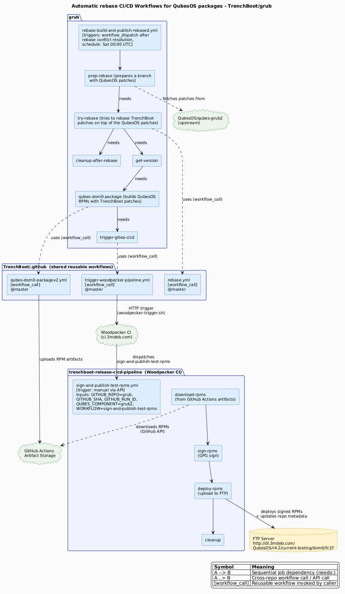
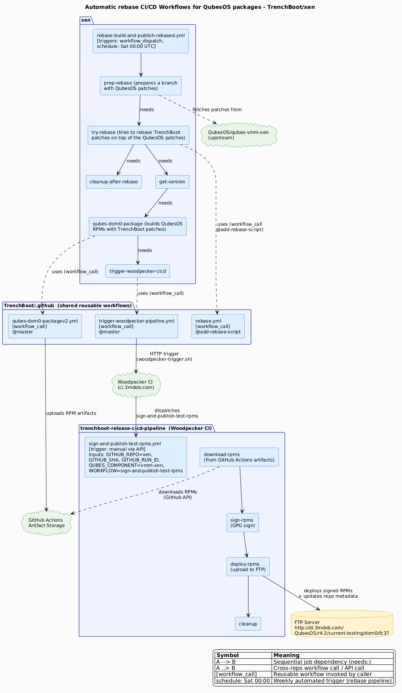

# Syncing with QubesOS patches

TrenchBoot project builds QubesOS packages for the following components:
1. [TrenchBoot/grub](https://github.com/TrenchBoot/grub) from branch `tb-dev`
2. [TrenchBoot/xen](https://github.com/TrenchBoot/xen) from branch `aem-next`
3. [TrenchBoot/qubes-antievilmaid](https://github.com/TrenchBoot/qubes-antievilmaid)
  from branch `main`
4. [TrenchBoot/secure-kernel-loader](https://github.com/TrenchBoot/secure-kernel-loader)
  from branch `skl-loader-amdsl-v11`

> Note that the fourth component is not a part of QubesOS and was developed as a
> part of TrenchBoot project. So there is no QubesOS repositories for this
> component. Hence, there is no need for a rebase CI/CDs for this component.

To provide the QubesOS users not only the packages with TrenchBoot patches but
the pckages with both TrenchBoot and QubesOS patches a set of automatic rebase
worklfows has been implemented for the three of the components mentioned above:

1. [TrenchBoot/grub](https://github.com/TrenchBoot/grub)
2. [TrenchBoot/xen](https://github.com/TrenchBoot/xen)
3. [TrenchBoot/qubes-antievilmaid](https://github.com/TrenchBoot/qubes-antievilmaid)

## TrenchBoot/grub

## TrenchBoot/xen

## TrenchBoot/qubes-antievilmaid

