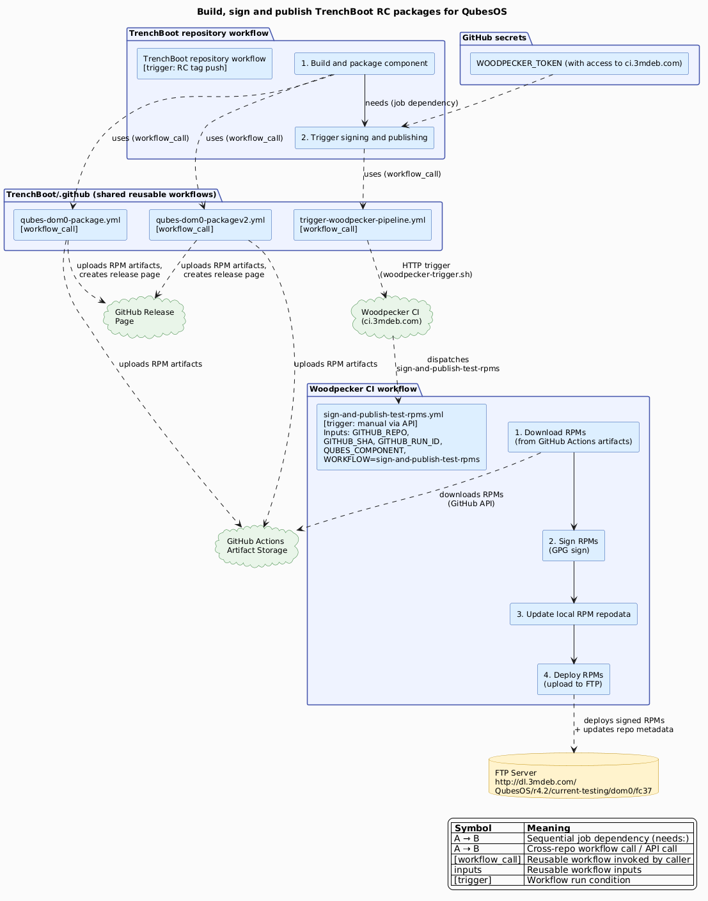

# QubesOS packages infrastructure

The TrenchBoot project builds QubesOS packages for the following QubesOS
components:

* [Xen](https://github.com/TrenchBoot/xen)
* [GRUB](https://github.com/TrenchBoot/grub)
* [qubes-antievilmaid](https://github.com/TrenchBoot/qubes-antievilmaid)
* [Secure Kernel Loader](https://github.com/TrenchBoot/secure-kernel-loader)

The general workflow for the release candidate (i.e., RC) packages is the
following:

{target="_blank"}

> Note that the workflow for signing might contain additional steps, e.g., for
> checking RPM repository metadata integrity, that are not shown on the diagram
> above. The diagram above presents only the steps that are necessary to
> understand the flow of building, signing, and publishing the packages.

The repository with the RC packages can be found
[here](https://dl.3mdeb.com/rpm/QubesOS/r4.2/current-testing/).
