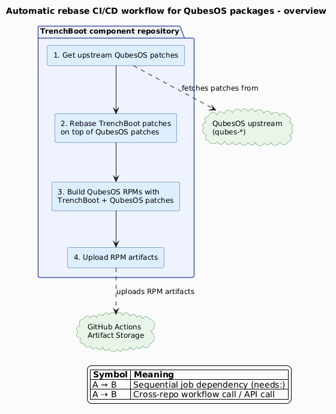
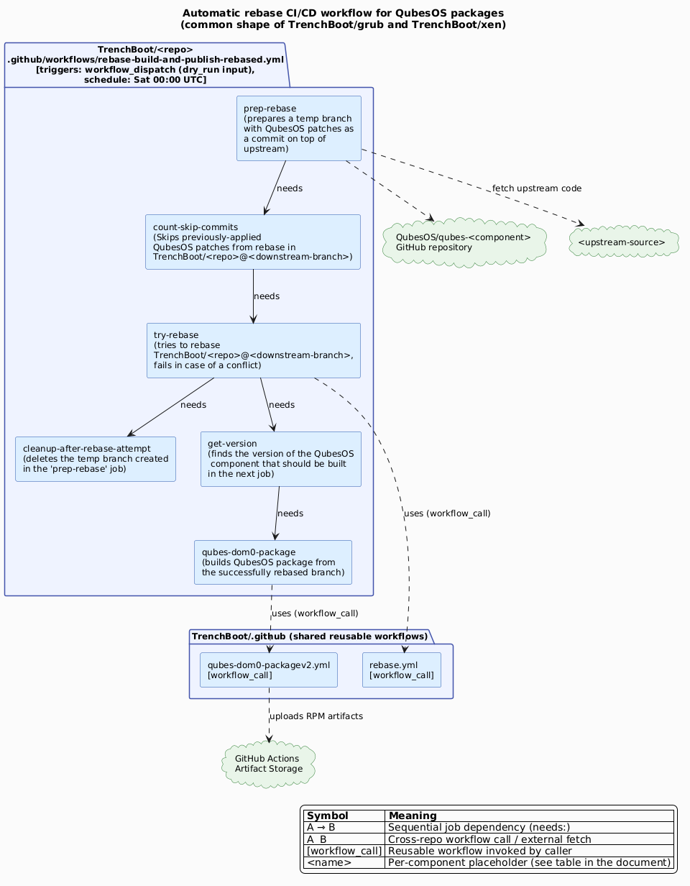
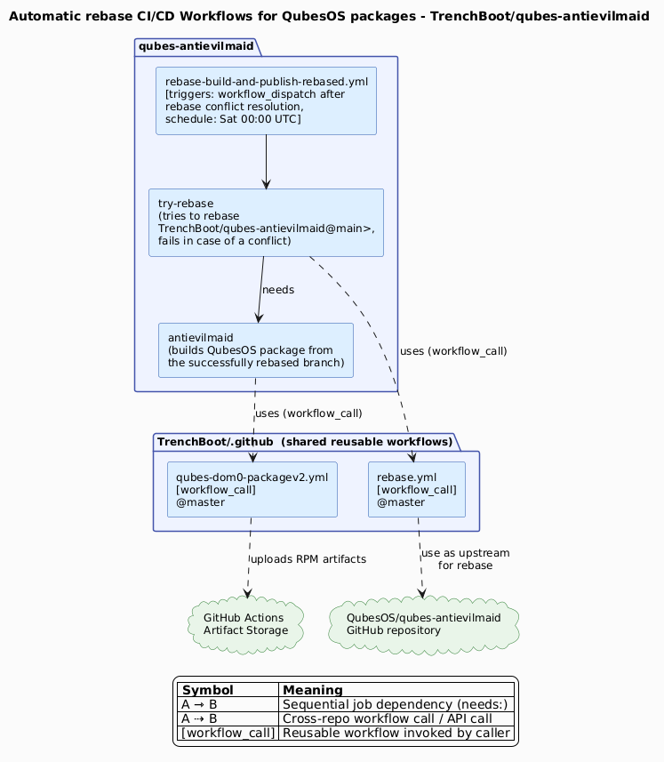

# Syncing with QubesOS patches

The TrenchBoot project builds QubesOS packages for the following components
outlined in the [QubesOS packages infrastructure](./qubesos-packages-infra.md).
To provide QubesOS users not only with the packages with TrenchBoot patches, but
also with the packages with both TrenchBoot and QubesOS patches, a set of
automatic rebase workflows has been implemented for the three components
mentioned below:

1. [TrenchBoot/grub](https://github.com/TrenchBoot/grub)
2. [TrenchBoot/xen](https://github.com/TrenchBoot/xen)
3. [TrenchBoot/qubes-antievilmaid](https://github.com/TrenchBoot/qubes-antievilmaid)

The general flow of each rebase workflow is the following:

{target="_blank"}

The per-component diagrams below show the same flow with the concrete workflows
and jobs. The difference between workflows for TrenchBoot/grub, TrenchBoot/xen,
and TrenchBoot/qubes-antievilmaid is caused by the different formats of code
histories for these components on the QubesOS side: the
[xen](https://github.com/qubesos/qubes-vmm-xen) and
[grub](https://github.com/qubesos/qubes-grub2) histories are stored as patches
while the [qubes-antievilmaid](https://github.com/qubesos/qubes-antievilmaid) as
commits. Hence, the TrenchBoot/grub and TrenchBoot/xen need a few additional
jobs to convert patches to `git` commits.

## TrenchBoot/grub and TrenchBoot/xen

{target="_blank"}

| Placeholder | `TrenchBoot/grub` | `TrenchBoot/xen` |
| --- | --- | --- |
| `<repo>` | `grub` | `xen` |
| `<component>` | `grub2` | `vmm-xen` |
| `<downstream-branch>` | `tb-dev-qubes` | `aem-next-qubes` |
| `<upstream-source>` | `gitlab.freedesktop.org/gnu-grub/grub.git` | `xenbits.xenproject.org/git-http/xen.git` |
| `<upstream-tag>` | `grub-<version>` | `RELEASE-<version>` |

## TrenchBoot/qubes-antievilmaid

