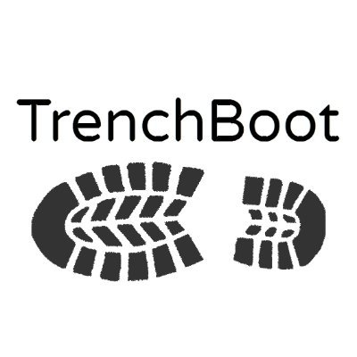

# TrenchBoot

{ class="center" }

TrenchBoot is a framework that allows individuals and projects to build
security engines to perform launch integrity actions for their systems. The
framework builds upon Boot Integrity Technologies (BITs) that establish one or
more Roots of Trust (RoT) from which a degree of confidence that integrity
actions were not subverted.
