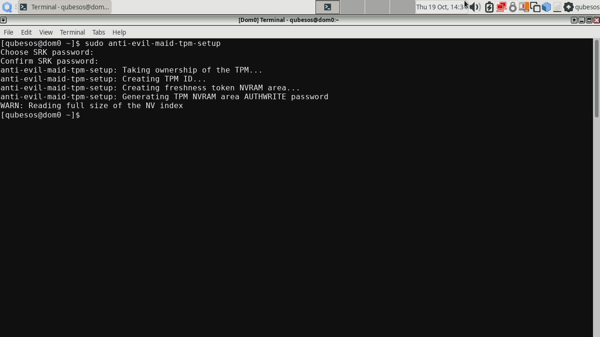
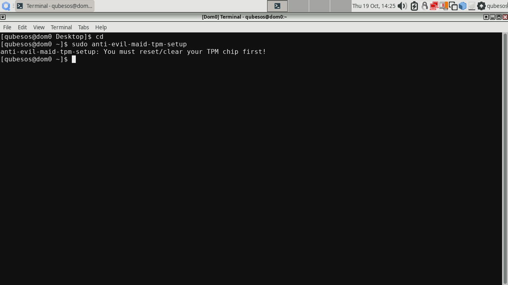
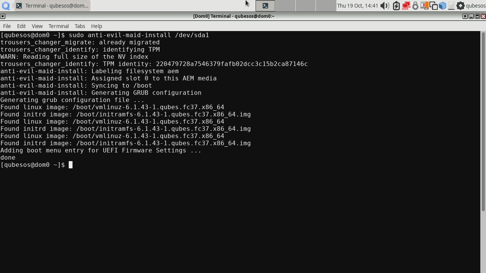
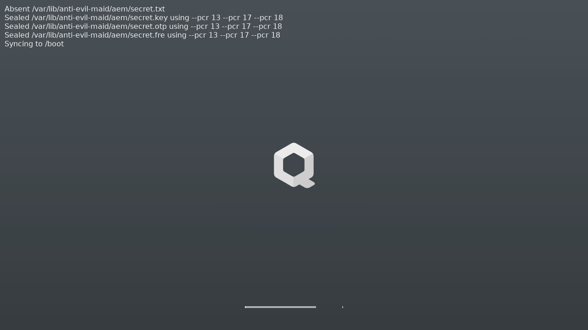

# Installing TrenchBoot AEM in Qubes OS

This document shows how to install Anti Evil Maid from packages
produced by 3mdeb as part of
[Trenchboot as Anti Evil Maid project](https://docs.dasharo.com/projects/trenchboot-aem-v2/).
If you wish to build the components yourself, please refer to
documentation for developers instead.

## Disclaimer

As of now, only legacy boot is supported. These instructions
<span style="color: red;">WON'T WORK under UEFI</span>. You have been
warned.

## Installation

To install, you have to first add a new repository and import a public
part of a key that was used to sign RPM packages.

### Adding AEM repository

To add a new repository, create in dom0 as root
`/etc/yum.repos.d/aem.repo` with the following content:

```text
[aem]
name = Anti Evil Maid based on TrenchBoot
baseurl = https://dl.3mdeb.com/rpm/QubesOS/r4.2/current/dom0/fc37
gpgcheck = 1
gpgkey = https://dl.3mdeb.com/rpm/QubesOS/r4.2/current/dom0/fc37/RPM-GPG-KEY-tb-aem
enabled = 1
```

The key specified in the file must be downloaded and imported to RPM:

```bash
qvm-run --pass-io sys-net \
    'curl -L https://dl.3mdeb.com/rpm/QubesOS/r4.2/current/dom0/fc37/RPM-GPG-KEY-tb-aem' \
    > RPM-GPG-KEY-tb-aem
sudo rpm --import RPM-GPG-KEY-tb-aem
```

Now it should be possible to download and install packages from AEM
repository.

### Installing prerequisite packages

As some of the packages are also available in standard QubesOS
repositories, potentially in newer versions, those must be temporarily
disabled during invocation of `qubes-dom0-update`, as shown in the
following commands. If any of the packages that are part of AEM are
updated in standard repos, you will have to choose between using new
versions or having working AEM, at least until new AEM release is
published or the code gets merged upstream. If you decide to restore
AEM after an update broke it, you will have to repeat the installation
of overwritten package with `--action=reinstall` added to
`qubes-dom0-update`, if it wasn’t present before.

Start by installing prerequisite packages. Those are not part of newly
added repository, but `qubes-dom0-current-testing`:

```bash
sudo qubes-dom0-update --enablerepo=qubes-dom0-current-testing \
    oathtool \
    openssl \
    qrencode \
    tpm-extra \
    trousers-changer \
    tpm-tools
```

Next set of new packages comes from AEM repository, to avoid conflicts
other repositories are disabled for this call:

```bash
sudo qubes-dom0-update --disablerepo="*" --enablerepo=aem \
    grub2-tools-extra \
    secure-kernel-loader
```

This is followed by reinstalling additional packages. A reinstall is
required because currently installed version is equal (or it may be
higher in the future) than those provided by AEM.

```bash
sudo qubes-dom0-update --disablerepo="*" --enablerepo=aem --action=reinstall \
    python3-xen \
    xen \
    xen-hypervisor \
    xen-libs \
    xen-licenses \
    xen-runtime \
    grub2-common \
    grub2-pc \
    grub2-pc-modules \
    grub2-tools \
    grub2-tools-minimal
```

### Updating GRUB

Booting on legacy systems (AEM currently doesn’t support UEFI)
requires manual installation of GRUB2 to the MBR of disk where Qubes
OS is stored. In the example below it is `/dev/sda`, yours may be
different. Remember that GRUB2 must be installed on disk and not on
partition, so don’t use `sda1`, `nvme0n1p1` etc.

```bash
sudo grub2-install /dev/sda
```

### Installing main AEM package

Finally, `anti-evil-maid` package may be installed:

```bash
sudo qubes-dom0-update --disablerepo="*" --enablerepo=aem anti-evil-maid
```

## Provisioning

All packages are in place. Before we can proceed with provisioning
AEM, the TPM must be cleared in the BIOS. Some platforms may require
disabling Intel Trusted Execution Technology (TXT) in order to clear
TPM. After you clear the TPM, remember to enable Intel TXT back,
otherwise AEM will not work. Once TPM is cleared, perform the TPM
setup:

```bash
sudo anti-evil-maid-tpm-setup
```



You will be prompted to set the SRK password, it is a password to
access TPM’s nonvolatile storage where the AEM secrets will be sealed.
If you failed to clear the TPM, you will be shown a message like this:



In that case, try clearing the TPM and run
`sudo anti-evil-maid-tpm-setup` again.

Now all that's left is proper installation of AEM. There are different
options, refer to `anti-evil-maid-install -h` for examples. In the
simplest case, AEM is installed on boot partition (not disk, i.e.
`sda1` instead of `sda` etc.) of Qubes OS. This can be done with a
simple command:

```bash
sudo anti-evil-maid-install /dev/sda1
```



After that, reboot the platform. On first boot you will be asked for
SRK password, followed by another question for disk encryption
password, after which a screen mentioning absent secret file will be
shown:



This is expected on the first boot after installation or an update to
one or more of measured components (GRUB, Xen, dom0 kernel and
initramfs).
