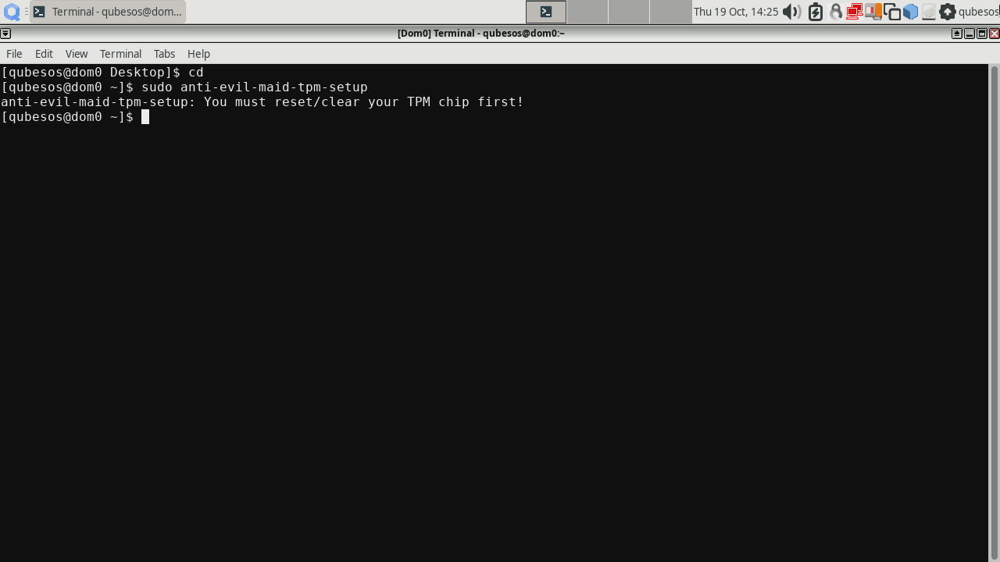
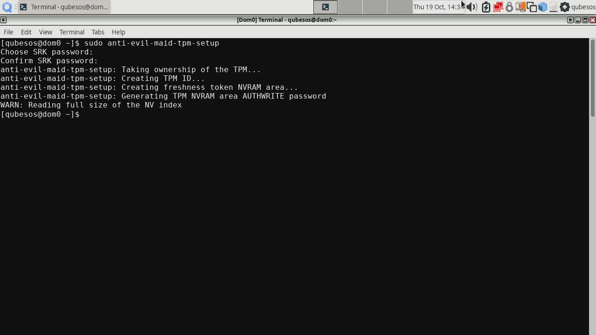
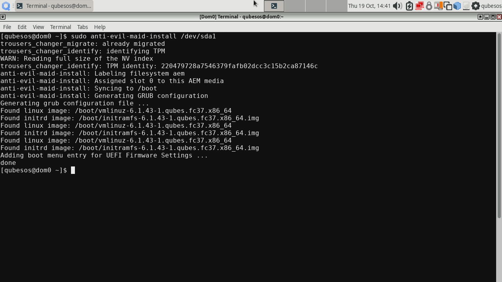
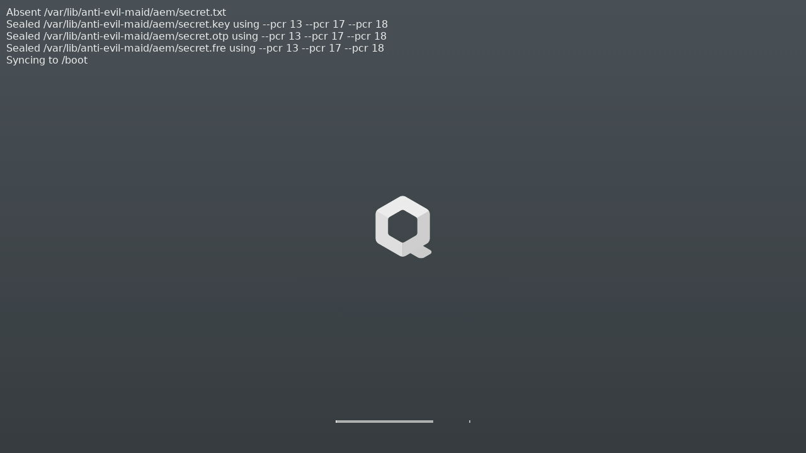

# Installing TrenchBoot AEM in Qubes OS

This document shows how to install Anti Evil Maid from packages produced by 3mdeb
as part of [TrenchBoot as Anti Evil Maid project](https://docs.dasharo.com/projects/trenchboot-aem-v2/).
If you wish to build the components yourself, please refer instead to developer documentation.

## Preparing the installation

Before you begin, it would save installation time by clearing the TPM of your device
before proceeding, otherwise you will need to reboot your computer
at [the provisioning](##Provisioning) step below.
Remember: enable Intel TXT after resetting your TPM.

To install TrenchBoot AME you will need to add a new repository, import a public
part of a key that was used to sign RPM packages, download and install
the appropriate packages, configure a new `.bin` file in the `/boot/`
directory and then configure AEM.

The entire process should take roughly 20 minutes to complete.

### Adding AEM repository

To add a new repository, create in dom0 as root `/etc/yum.repos.d/aem.repo`
with the following content:

```ini
[aem]
name = Anti Evil Maid based on TrenchBoot
baseurl = https://dl.3mdeb.com/rpm/QubesOS/r4.2/current/dom0/fc37
gpgcheck = 1
gpgkey = https://dl.3mdeb.com/rpm/QubesOS/r4.2/current/dom0/fc37/RPM-GPG-KEY-tb-aem
enabled = 1
```

The specified key must be downloaded and imported to RPM:

```bash
qvm-run --pass-io sys-net \
    'curl -L https://dl.3mdeb.com/rpm/QubesOS/r4.2/current/dom0/fc37/RPM-GPG-KEY-tb-aem' \
    > RPM-GPG-KEY-tb-aem
sudo rpm --import RPM-GPG-KEY-tb-aem
```

### Intel systems dependencies

If your device has an Intel CPU, download [the official package from Intel](https://cdrdv2.intel.com/v1/dl/getContent/630744).
Select the correct ACM .bin corresponding to your CPU (using the .PDF
included in the zip as a guide) and move the `.bin` into the dom0 `/boot/` directory.

Helpful commands:
`unzip <zip.acrhive.name>`- to unzip the Intel .zip archive.
`mv <ACM.bin> /boot/` - to move the correct ACM to `/boot`.

### Installing prerequisite packages

Start by installing prerequisite packages. Those are not part of newly added
repository, but `qubes-dom0-current-testing`:

```bash
sudo qubes-dom0-update --enablerepo=qubes-dom0-current-testing \
    oathtool \
    openssl \
    qrencode \
    tpm-extra \
    trousers-changer \
    tpm-tools
```

#### Prepare a list of AEM packages

For convenience, the packages can be saved to an environment variable,
by simply typing into the dom0 terminal, or copying a text file
from a disposable qube:

```shell
packages=(
    "anti-evil-maid-4.2.1-1.fc37.x86_64"
    "grub2-common-2.13-1.fc37.noarch"
    "grub2-tools-2.13-1.fc37.x86_64"
    "grub2-tools-extra-2.13-1.fc37.x86_64"
    "grub2-tools-minimal-2.13-1.fc37.x86_64"
    "python3-xen-4.17.5-7.fc37.x86_64"
    "xen-4.17.5-7.fc37.x86_64"
    "xen-hypervisor-4.17.5-7.fc37.x86_64"
    "xen-libs-4.17.5-7.fc37.x86_64"
    "xen-licenses-4.17.5-7.fc37.x86_64"
    "xen-runtime-4.17.5-7.fc37.x86_64"
)
```

##### Legacy Systems

If your system has a legacy BIOS, run:

```shell
packages+=(
    "grub2-pc-2.13-1.fc37.x86_64"
    "grub2-pc-modules-2.13-1.fc37.noarch"
)
```

##### UEFI Systems

If your system has a UEFI BIOS, run:

```shell
packages+=(
    "grub2-efi-x64-2.13-1.fc37.x86_64"
    "grub2-efi-x64-modules-2.13-1.fc37.noarch"
)
```

##### AMD systems

If your systems has an AMD CPU, run:

```shell
packages+=(
    "secure-kernel-loader-0+224af56470eff64f2cc1f74c1e1099d3f170636f-1.fc37.x86_64"
)
```

#### Installing

Install the packages (first command reinstalls existing packages in case the
same version numbers exist in official Qubes repositories, second one only
adds new packages). If the first command fails, it means that there are no
conflicting packages with the same version number in official Qubes repositories:

```shell
sudo qubes-dom0-update --disablerepo="*" --enablerepo=aem --action=reinstall -y ${packages[@]}
sudo qubes-dom0-update --disablerepo="*" --enablerepo=aem --action=install -y ${packages[@]}
```

At this point, if you are installing on an UEFI system,
you may skip to [Installing main AEM package](###Installing-main-AEM-package)

#### Updating GRUB on legacy systems

Booting on legacy systems requires manual installation of GRUB2 to the MBR
of disk where Qubes OS is stored. If your systems has a Legacy BIOS, follow
these instructions.

If you are sure where the root partition is located, you can skip the
following steps explaining how to find it out.

To check on which drive is your OS installed, run:

1. Get the Logical Volume (LV) file:

    ```bash
    df --output=source /
    ```

    Example LV file: `/dev/mapper/qubes_dom0-root`

1. Map the Logical Volume (LV) to a Volume Group (VG):

    ```bash
    sudo lvs /dev/mapper/qubes_dom0-root --noheadings -o vg_name
    ```

    Example VG name: `qubes_dom0`

1. Map the Volume Group to a Physical Volume (PV):

    ```bash
    sudo vgs --noheadings -o pv_name qubes_dom0
    ```

    Example PV file: `/dev/mapper/luks-12345678-1234-1234-1234-123456789abc` (GUID)

1. Find the PV name in `lsblk` output and check on which device it is
located.

    ```bash
    lsblk -o NAME
    ```

    Example output:

    ```text
    sda
    ├─sda1
    ├─sda2
    └─sda3
      └─luks-12345678-1234-1234-1234-123456789abc
    ```

    The drive on which the root partition is located in this example is
    therefore `/dev/sda`.

Remember that GRUB2 must be installed on disk and
not on partition, so don’t use `sda1`, `nvme0n1p1` etc. This step should be
skipped on UEFI systems.

```bash
sudo grub2-install /dev/sda
```

### Installing main AEM package

Finally, `anti-evil-maid` package may be installed:

```bash
sudo qubes-dom0-update --disablerepo="*" --enablerepo=aem \
    anti-evil-maid-4.2.1-1.fc37.x86_64
```

## Provisioning

All packages are now installed.

Before we can proceed with provisioning AEM, the TPM must be cleared in the BIOS
(i.e. TPM Authentication Reset).Some platforms may require disabling Intel's
Trusted Execution Technology (TXT) in order to clear the TPM.

If you failed to clear the TPM as noted at the beginning of the guide,
you will be shown a message like this:



In that case, try clearing the TPM in your BIOS and run the command again.
After you clear the TPM, remember to enable Intel TXT back,
otherwise AEM will not work.

Once the TPM is cleared, perform the TPM setup:

```bash
sudo anti-evil-maid-tpm-setup
```



You will be prompted to set the SRK password. The SRK password enables access
the TPM’s nonvolatile storage where the AEM secrets will be sealed.

Now all that's left is proper installation of AEM. (Note: There are different options,
refer to `anti-evil-maid-install -h` for examples.) In the simplest case, AEM is
installed on boot partition (not disk, i.e. `sda1` instead of `sda` etc.) of
Qubes OS. Run this command to find out where your boot partition is installed:

```bash
df --output=source /boot
```

Assuming that your boot partition is installed on `/dev/sda1`, the
installation can be done with a simple command:

```bash
sudo anti-evil-maid-install /dev/sda1
```



After that, reboot the platform. On first boot you will be asked for the SRK
password, followed by another question for disk encryption password, after which
a screen mentioning an absent secret file will be shown:



This is expected on the first boot after installation or an update to one or
more of measured components (GRUB, Xen, dom0 kernel and initramfs).

After rebooting for the second time, the Anti Evil Maid should be up
and running.
