# TrenchBoot OpenQA user guide

## OpenQA

OpenQA is a tool for performing automated testing of operating systems developed
by SUSE. It is used by multiple Linux distributions like OpenSUSE, Fedora and
QubesOS.

The results of TrenchBoot automated tests can be viewed on
[the project's OpenQA instance][openqa-instance].

## Usage

The website allows anyone to freely monitor all the details about the tests run,
including:
- configuration variables
- collected logs
- screenshots and a video recording of the screen for the duration of a test
- the results and the reasons behind fails

Anyone can login to the website via GitHub, but only the authorized
accounts are able to:
- run the tests
- create new tests
- modify any settings
- add new devices

## Navigation

The main page of the OpenQA website shows a summary of the most recent test
runs.

The tests are organized into _Job Groups_, like "Qubes".
The test groups contain _Products_, like "Build4.2.3".
Each _Product_ consists of multiple _Test Suites_. On the main page
every distinct _Product_ has a progress bar showing how many _Test Suites_
have passed, are running, are finished and were skipped.

|
|:-:|
|Image of the main page, show job groups, products and test suite progress|

From this page there is a couple of options for further navigation to access
more precise data.

### Job Group

_Job Groups_ simply a way to organize all of the maintained _Products_ into
thematic categories.

Clicking on the name of a _Job Group_ shows its details. Most importantly all
of the historical _Products_ that were published as a part of the _Job Group_.
In addition to that, authorized users can leave comments about the _Job Group_
there.

|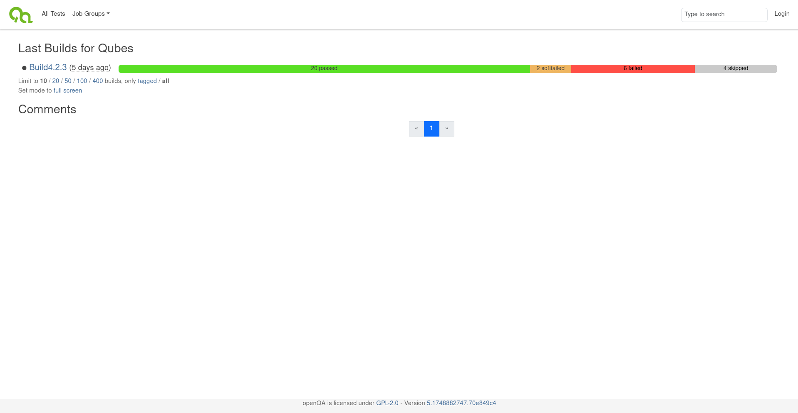
|:-:|
|Image of the Job Group view|

### Product

A _Product_ represents one run of a set of test suites with given parameters.
The name of the products consists of a couple parts
It consists of:
- The name of the tested OS distribution - to run tests on every maintained
  distribution
- The version - to allow running the tests on every new release
- The flavor - to allow testing every flavor of the OS separately
- The hardware architecture - to run on every supported architecture

Testing TrenchBoot requires to cover all of the supported hardware platforms,
not only run a single test per hardware architecture. For this reason the
_Flavor_ field of a _Product_ is used a bit unconventionally. At this moment
TrenchBoot does not consist of multiple _Flavors_ and the field is used to
determine:
- on which hardware platform the tests were performed
- whether it was installed on a Legacy or an UEFI BIOS

|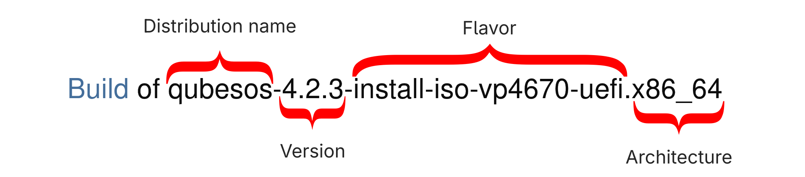|
|:-:|
|Product name made of four sections|

Clicking on a _Product_ from the main page, or the _Job Group_ details page
shows the summary of the _Product_ and a list of the _Test Suites_ associated
with it.

|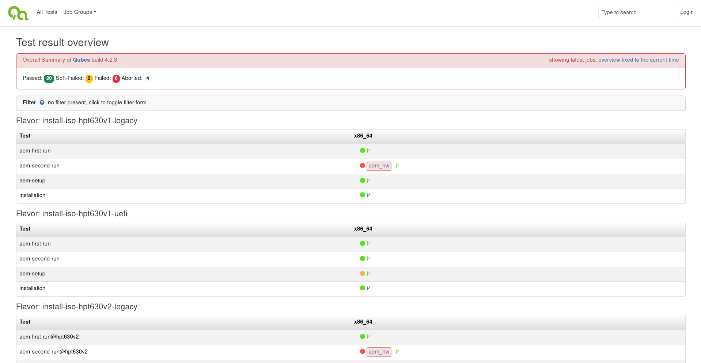|
|:-:|
|Image of a product view with list of tests|

### Test Suite

_Test Suites_ are the essence of the OpenQA web panel. Next to every test suite
you can see a small colorful circle informing about the status of the
_Test Suite_. The most common statuses are:
- Gray - Skipped
    + The test was decided to not be performed based on the results of
    other tests, like its dependencies failing
- Green - Pass
    + The test passed without any issues
- Red - Fail
    + The test encountered a critical issue, the testing is stopped
- Yellow - Soft Fail
    + The test encountered a non-critical issue, the testing may continue

By clicking on the status circle icon informing on the status of the
_Test Suite_, the details of the selected _Test Suite_ can be accessed.

|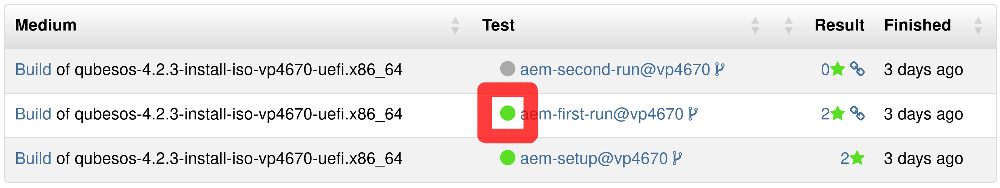|
|:-:|
|Image of the circle to press, which is very small and a bit unintuitive, marked with a red rectangle|

Upon doing so the page of the selected _Test Suite_ run as
a part of a _Product_ will be shown. It contains a short
summary of the _Test Suite_ and a tab bar containing
a couple tabs with more details.

#### Details Tab

The default tab shown when selecting a _Test Suite_ is its
_Details_ tab. It contains a summary of all of the _Tests_ being a part of
the _Test Suite_ and their statuses.

Every single test consists of one or more _Asserts_, which
are used to determine whether the test _Passes_ or _Fails_.
The _Details_ page shows the proofs for every _Assert_ during
a test. The proofs are:
- screenshots, which are being asserted
  by comparing selected parts of the screen to the expected outcomes
- text logs, compared to expected outputs

|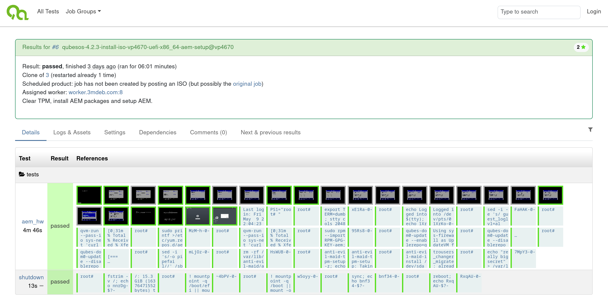|
|:-:|
|_The details tab_|

The details of any assert and the reason for pass or fail can be viewed by
clicking on the corresponding box in any _Test Suite_.

|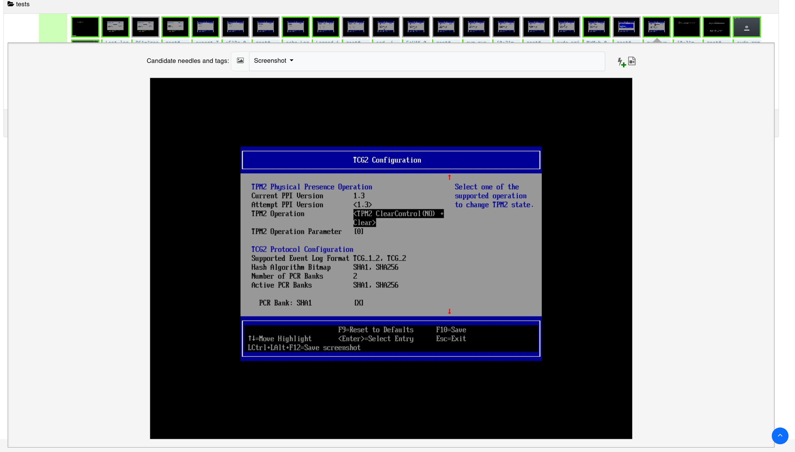|
|:-:|
|_Image of a screenshot needle assert selected_|

|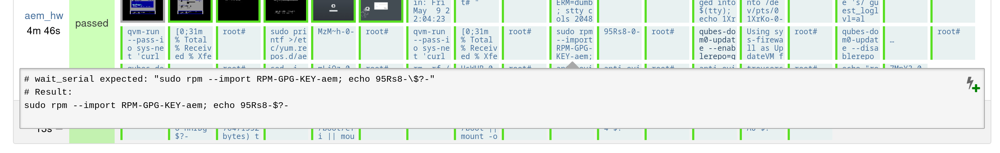|
|:-:|
|Image of a text needle assert selected|

#### Logs & Assets Tab

The _Logs & Assets_ tab contains all of the downloadable
content created during the _Test Suite_. This includes:
- `Video` - A video recording of the screen for the whole duration of the _Test Suite_
- `autoinst-log.txt` - Logs from the test
- `worker-log.txt` - Logs created by the OpenQA worker process running
  on the tested device
- `vars.json` - A JSON file containing all of the configuration variables
used to control the execution of the _Test Suite_
- `serial0.txt` - The serial port output from the tested device
- `serial_terminal.txt` - The terminal output from text-based tests in the terminal

|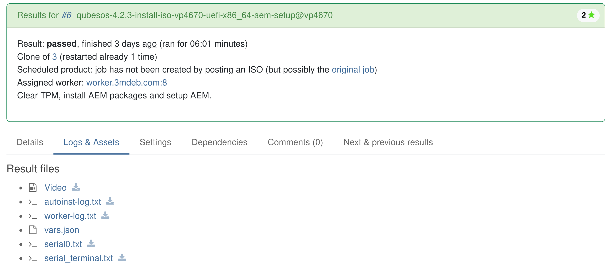|
|:-:|
|The Logs & Assets tab|

#### Settings Tab

The Settings tab visually shows the most important configuration
variables that affected the _Test Suite_. It is a subset of what's available
in the `vars.json` file from the _Logs & Assets Tab_

|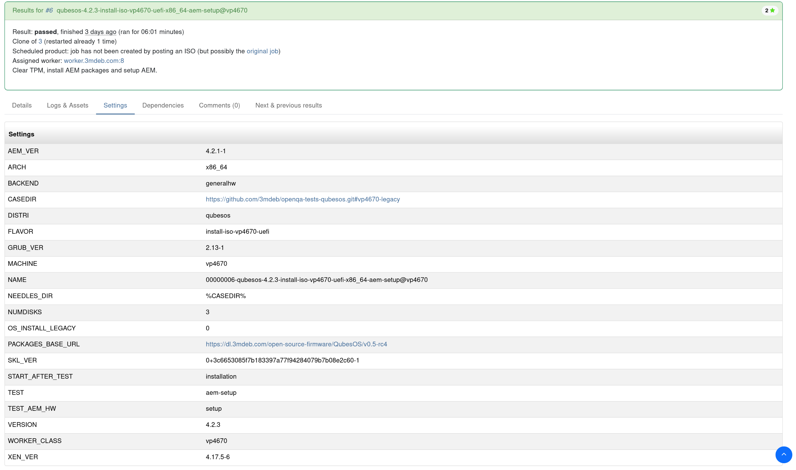|
|:-:|
|The Settings tab|

#### Dependencies Tab

The test suites are run in parallel by default. The _Dependencies_ tab shows
how the _Test Suite_ depends on
other suites using a schematic.
The suites, upon which the _Test Suite_ depends
must be finished before it can be run. The order of execution follows the
direction of the arrows.

|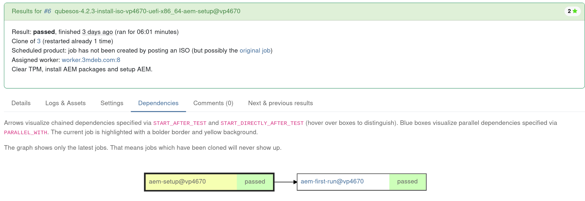|
|:-:|
|The Dependencies tab|

#### Comments Tab

The comments tab gives the authorized users a place to discuss
the results of a test suite. Depending on whether a discussion has arisen
in the exact suite it might not contain any useful information.

||
|:-:|
|The Comments tab|

A test containing comments is marked with a blue speech bubble
|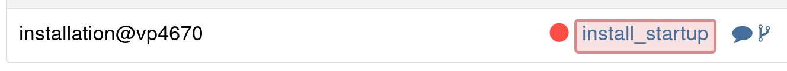|
|:-:|
|A test containing comments|

#### Next & Previous Results Tab

The _Next & Previous Results_ tab gives a useful insight about the history
of regression and fixes regarding the feature tested by the test suite.
It shows how the selected _Test Suite_ worked on other
_Products_ - historical, and future ones if the _Product_ in which the
selected _Test Suite_ was run is not the newest one released.

|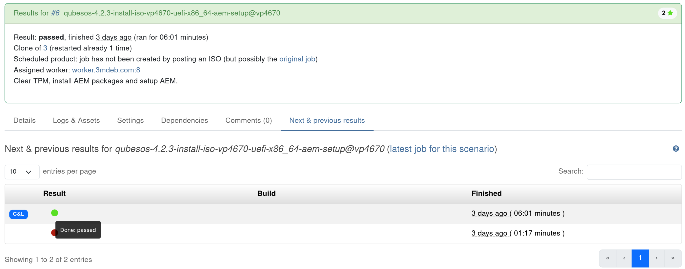|
|:-:|
|The Next & Previous results tab|

### All Tests Tab

The _All Tests_ tab visible on the topmost part of every page gives access
to a view of the most recent test suites running and the historical runs
in order, as well as tests that are currently in progress.

Every test suite entry lists the _Product_ for which the suite is run,
the name of the suite and its status. Pressing the colorful status circle
enters the test suite page exactly like when doing so from the product details
page.

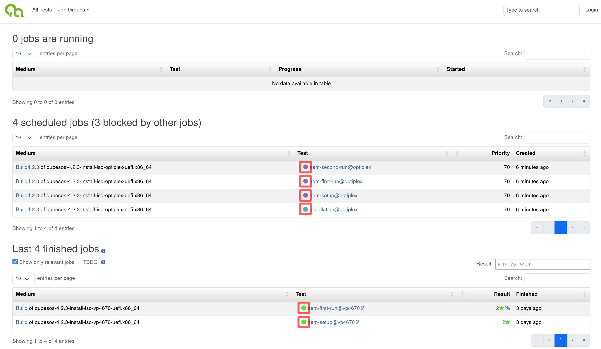|
|:-:|
|The All Tests tab, status circles marked with red rectangles|

### Job Groups Tab

The _Job Groups_ tab in the uppermost part of every page contains a drop-down
list of all the _Job Groups_ existing on this OpenQA instance.
The _Job Groups_ which don't contain any _Products_ are not visible on the
OpenQA homepage, but can be accessed using this tab.

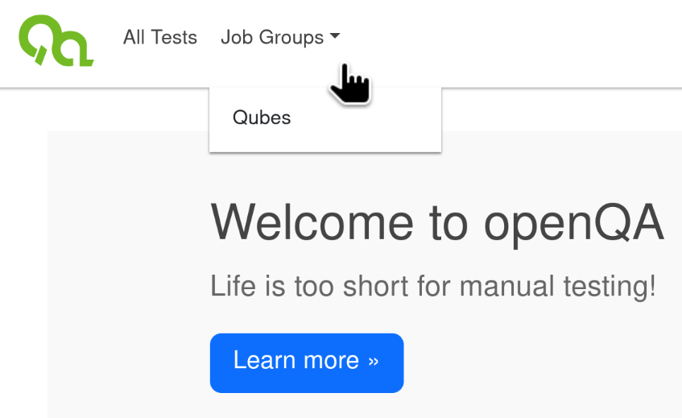|
|:-:|
|The Job Groups drop down menu|

[openqa-instance]: https://openqa.3mdeb.com
